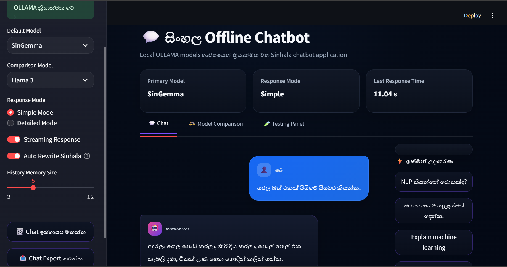
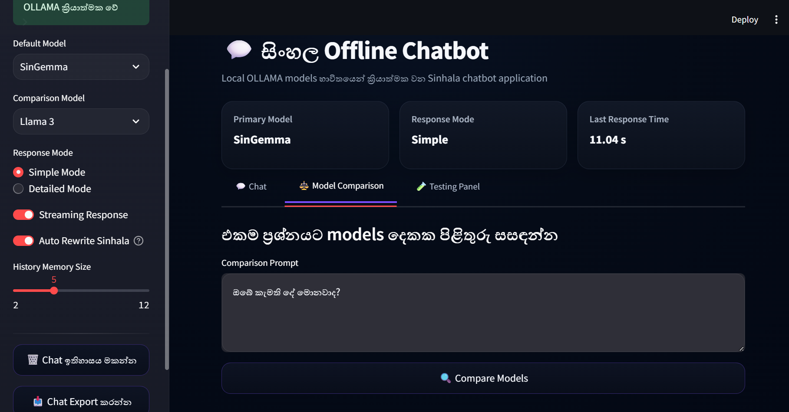
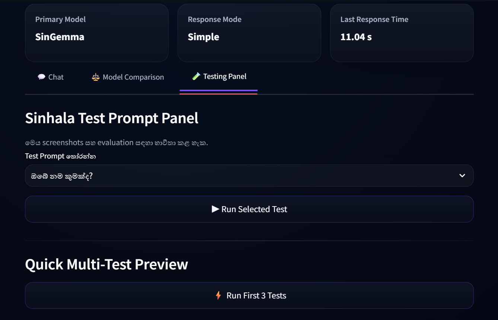

# Sinhala Offline Chatbot

Fully offline Sinhala chatbot
Local inference with OLLAMA
Streamlit-based interactive UI
Prompt engineering + rewrite mechanism

## Features
- Sinhala input and Sinhala output
- Fully offline local inference
- Streamlit chat interface
- Session-based chat history
- Model comparison panel
- Testing panel with predefined prompts
- Sinhala rewrite mechanism
- Chat export

## Technologies
- Python
- Streamlit
- OLLAMA
- Requests

## Project Structure
- `app.py` – main Streamlit app
- `chatbot.py` – model interaction and response logic
- `prompts.py` – system prompts and few-shot examples
- `ui.py` – UI rendering and styling
- `utils.py` – helper functions
- `requirements.txt` – dependencies

## How to Run
1. Install dependencies:
   ```bash
   pip install -r requirements.txt
2. Start OLLAMA:
   ```bash
   ollama serve
3. Pull required models:
   ```bash
   ollama pull Tharusha_Dilhara_Jayadeera/singemma
   ollama pull llama3:latest
4. Run the app:
   ```bash
   streamlit run app.py

## Evaluation Summary
- SinGemma performed better overall in this implementation
- Llama 3 produced fewer usable outputs in the recorded test set
- Rewrite mechanism improved mixed-language output quality

## Screenshots

### Main Chat Interface


### Sinhala Interaction Example


### Model Comparison Panel


### Testing Panel

